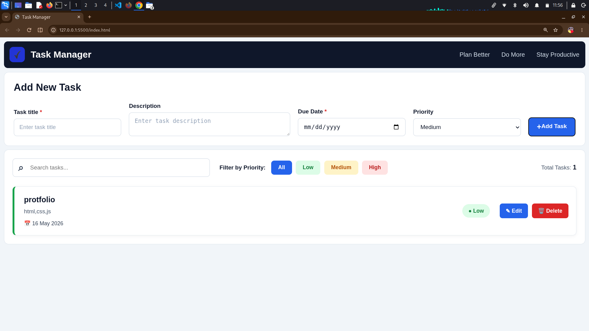

# Task Manager

## Project Description

Task Manager is a responsive task management web application built using **HTML5, CSS3, and JavaScript**.

The application allows users to create, search, filter, edit, and delete tasks. Each task contains a title, description, due date, and priority level.

The project also uses **LocalStorage** to save tasks in the browser, so tasks remain available even after refreshing the page.

The interface is designed to work across **desktop, laptop, tablet, and mobile devices**.

### Main Features

- Add new tasks
- Edit existing tasks
- Delete tasks
- Set task priority
- Set task due date
- Search tasks
- Filter tasks by priority
- Display total number of tasks
- Save tasks using LocalStorage
- Responsive design
- Mobile-friendly interface
- Clean and simple UI
- Dynamic task rendering
- HTML escaping for safer task rendering

---

## Screenshot




---

## Technologies Used

- **HTML5** — Structure of the application
- **CSS3** — Styling, layout, responsive design, and animations
- **JavaScript (ES6+)** — Application logic and interactivity
- **DOM Manipulation** — Dynamically creating and updating task cards
- **LocalStorage API** — Saving tasks in the browser
- **Git & GitHub** — Version control and project hosting

---

## What I Learned

While building this project, I learned and practiced:

- Creating forms using HTML
- Working with input fields, textarea, select, and buttons
- Creating a clean user interface with CSS
- Using CSS Grid
- Using CSS Flex-box
- Creating responsive layouts
- Using CSS Media Queries
- Designing layouts for desktop, tablet, and mobile devices
- Handling form submission with JavaScript
- Creating JavaScript objects
- Working with arrays
- Using `filter()`, `find()`, and `findIndex()`
- Creating dynamic HTML using JavaScript
- DOM manipulation
- Implementing CRUD operations
- Implementing search functionality
- Implementing priority filters
- Working with LocalStorage
- Using `JSON.stringify()` and `JSON.parse()`
- Formatting dates with JavaScript
- Using event listeners
- Creating reusable functions
- Validating form inputs
- Using HTML escaping to safely display user input

---

## Responsive Design

The application is responsive and adapts its layout according to the screen size.

### Desktop

- Horizontal navigation
- Multi-column task form
- Horizontal task cards
- Search and filters arranged in one row

### Tablet

- Adaptive form layout
- Responsive task controls
- Flexible priority filters
- Task cards adjust according to available space

### Mobile

- Vertical navigation
- Single-column task form
- Full-width buttons
- Stacked task cards
- Mobile-friendly search box
- Responsive priority filters
- Responsive edit and delete buttons

### Responsive Breakpoints

```text
Desktop
↓
max-width: 1100px

Tablet
↓
max-width: 768px

Mobile
↓
max-width: 480px
```

---

## How to Run

### 1. Clone the Repository

```bash
git clone https://github.com/your-username/task-manager.git
```

### 2. Open the Project

```bash
cd task-manager
```

### 3. Run the Project

Open `index.html` in your browser.

You can also use **VS Code Live Server**:

1. Open the project in VS Code.
2. Install the **Live Server** extension.
3. Right-click `index.html`.
4. Select **Open with Live Server**.

---

## Project Structure

```text
task-manager/
│
├── index.html
│
├── asset/
│   │
│   ├── css/
│   │   └── style.css
│   │
│   ├── js/
│   │   └── main.js
│   │
│   └── img/
│       ├── logo.png
│       └── task-manager.png
│
└── README.md
```

---

## CRUD Operations

The project implements complete CRUD functionality.

### Create

Users can create a new task by entering:

- Task title
- Description
- Due date
- Priority

### Read

Saved tasks are displayed dynamically on the page.

### Update

Users can edit an existing task and update its information.

### Delete

Users can delete tasks after confirming the deletion.

---

## Search Functionality

The search feature allows users to search tasks by:

- Task title
- Task description

Search results update dynamically as the user types.

---

## Priority Filter

Users can filter tasks according to priority:

- **All**
- **Low**
- **Medium**
- **High**

---

## LocalStorage

The application uses the browser's **LocalStorage API** to store task data.

Tasks are converted into JSON before being stored:

```javascript
localStorage.setItem("tasks", JSON.stringify(tasks));
```

When the application loads, the saved tasks are retrieved:

```javascript
const savedTasks = localStorage.getItem("tasks");
```

This allows task data to remain available after refreshing the browser.

---

## Live Demo

🔗 **Live Demo:**  
https://jovial-malasada-347825.netlify.app/

---

## GitHub Repository

🔗 **GitHub Repository:** 
https://github.com/akshat018k/Task-Manager.git

---

## Author

**Akshat Kumbhani**

B.Sc. IT Student | Full Stack Developer

---

## License

This project was created for **learning, practice, and portfolio purposes**.
